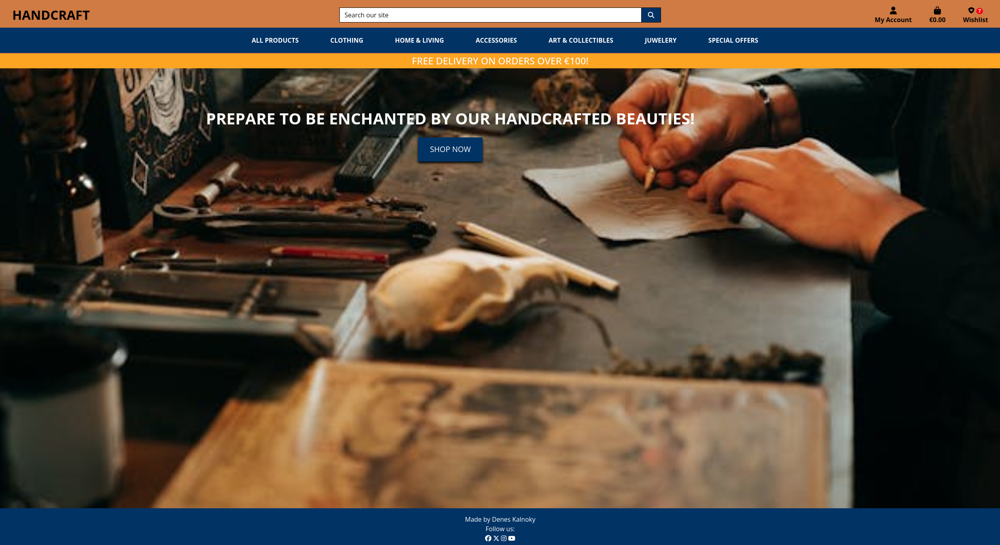
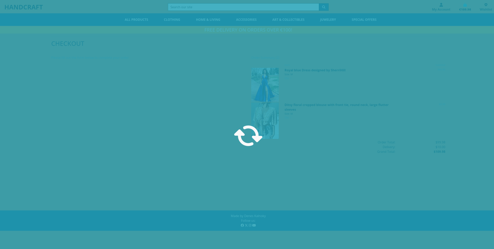
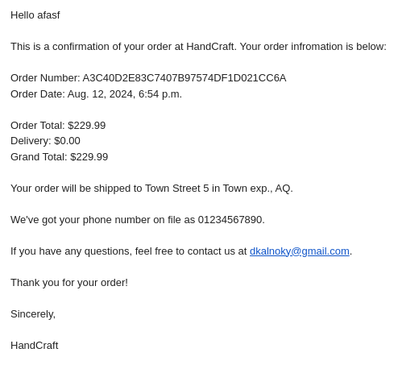

# **HandCraft**
HandCraft is an e-commerce store specializing in selling all kinds of handmade items, from accessories to jewelry, art, collectibles, formal and casual wear, and home & living items, including delicate furniture of all sorts.

HandCraft exclusively sells handmade products and offers a wide selection at various price points to appeal to a large group of potential clients.

This site was created for Portfolio Project #5 (E-Commerce Applications Portfolio Project) as part of the Diploma in Full Stack Software Development at the [Code Institute](https://www.codeinstitute.net).

[View live website here](https://project-5-39f95920fba3.herokuapp.com/)

# Table of Content

* [**Project**](<#project>)
    * [Objective](<#objective>)
    * [Site Users Goal](<#site-users-goal>)
    * [Site Owners Goal](<#site-owners-goal>)
    * [Business Model](<#business-model>)
    * [Marketing Techniques](<#marketing-techniques>)
    * [Project Management](<#project-management>)

* [**User Experience (UX)**](<#user-experience-ux>)
    * [User Stories](<#user-stories>)
    * [Site Structure](<#site-structure>)
    * [Design Choices](<#design-choices>)

* [**Existing Features**](<#existing-features>)
    * [Top Bar](<#top-bar>)
    * [Navigation](<#navigation>)
    * [Home](<#home>)
    * [Products](<#products>)
    * [Shopping Cart](<#shopping-cart>)
    * [Secure Checkout](<#secure-checkout>)
    * [Order Confirmation](<#order-confirmation>)
    * [Confirmation Emails](<#confirmation-emails>)
    * [Sign Up](<#sign-up>)
    * [Sign In](<#sign-in>)
    * [Password Reset](<#password-reset>)
    * [Sign Out](<#sign-out>)
    * [Footer](<#footer>)
    * [Visual Feedback To The User](<#visual-feedback-to-the-user>)

* [**Features Left To Implement**](<#features-left-to-implement>)

* [**Technologies Used**](<#technologies-used>)
    * [Languages](<#languages>)
    * [Frameworks & Software](<#frameworks--software>)
    * [Libraries](<#libraries>)

* [**Testing**](<#testing>)
    * [Testing User Stories](<#testing-user-stories>)
    * [Code Validation](<#code-validation>)
    * [Additional Testing](<#additional-testing>)
    * [Known Bugs](<#known-bugs>)
* [Deployment](<#deployment>)
* [Credits](<#credits>)
* [Acknowledgements](<#acknowledgements>)

# **Project**

## Objective
I decided to build an online store focused on handmade products because I believe that most people can identify with handmade items and are willing to buy them, knowing they are getting products crafted with human time and expertise to ensure high quality and longevity. I aimed to create the site as authentically as possible while demonstrating my knowledge of the Django framework, Python, JavaScript, CSS, and HTML.

## Site Users Goal
The users of 'HandCraft' are a diverse group of people with various interests and desires, including art lovers, collectors, fashion enthusiasts, jewelry lovers, and more. The site provides a unique platform where users can find rare and delicate custom-made products all in one place. HandCraft offers items that are seldom found elsewhere, providing users the convenience of ordering them from the comfort of their own homes.

## Site Owners Goal
The goal of the site owner is to create a platform where users can intuitively purchase handcrafted items of all sorts, combining multiple genres in one place.

## Business Model
To know which business model that fits the needs and requirements for a business is of course very important. HandCraft is a business that sells the products directly to the end users through direct selling via the HandCraft webpage. The buyers are private consumers which makes HandCraft business model a B2C (Business To Consumer)-model. This means that everytime a HandCraft customer buys something from the webpage a B2C transaction is completed. To be able to implement a B2C eCommerce model in a successful way it is very important to have a quickly adjustable platform to be able to adapt to the customers if needed. The HandCraft webpage is a highly adjustable platform which makes fast adjustments quite easy. But to have a solid platform is not everything, of course there is a need for good marketing techniques to be able to reach out to new customers and engage the existing ones.

## Marketing Techniques
There are a lot of different marketing techniques out there. For HandCraft there has from the start been some areas that builds the foundation of the HandCraft trademark, and also sets the prerequisites to reach the customers.

* **Optimize For Mobile Devices**

In a world where most of the people visits the web from a mobile device it is very important that the site looks good on mobiles and tablets. The HandCraft site is fully responsive which means that it takes into account whether the customer uses a mobile or desktop device.

* **The Website Layout**

The HandCraft website is easy to navigate and have an intuitive design which makes it easy for the customer to find relevant information and make a purchase without a hassle.

* **Rate content**

On the HandCraft site, there is a Customer Review section that displays user ratings below each product. This helps the HandCraft team better understand the desires and needs of their customers and can serve as an indicator for adding new products to the stock. This makes it possible to offer more relevant products in the future that better fit user needs. HandCraft's ambition is for customers to visit our site because they want to, not because we want them to.

* **Facebook and Instagram (social media marketing)**

Social Media marketing is a great tool if it's done in the right way. HandCraft has a presence on social media through Facebook. It helps HandCraft to communicate with both existing customers but also potential new ones. Through the social media platforms HandCraft can create engagement, interact on a broad level and maintain brand recognition. For HandCraft the product sale is being made on the site why it is very important to use the social media platforms to boost traffic to the website (i.e. when a new collection has been published or when the product of the month has been released). For now HandCraft only focuses on organic growth but will most likely start with payed ads to target specific customer groups in the future.

View the Facebook page at: [HandCraft Facebook page](https://www.facebook.com/profile.php?id=61563089110829)

<b>HandCraft - Facebook</b>

 

<b>HandCraft - Facebook 2</b>

 

* **Search Engine Optimization (SEO)**
Search Engine Optimization is a very important method to improve the ranking on search-engines (and has a high Return Of Investement if done right). The ambition is that HandCraft includes relevant, professional and reliable content and offers a hassle free experience for the site user. Descriptive Meta Tags have been implemented on the site after a brainstorming session (and use of [Wordtracker](https://www.wordtracker.com/)). The final description / words that have been used can be seen below:

    * Meta Description - Explore HandCraft's unique collection of handmade goods across various genres. Discover exquisite pieces for your home, wardrobe, and more. Shop now and experience the artistry firsthand.

    * Meta Keywords - HandCraft, handmade goods, unique items, home decor, clothing, jewelry, art, collectibles, accessories

The site also includes a sitemap.xml and robots.txt to make sure that the search engines can find and crawl the pages on the site.

[Back to top](<#table-of-content>)

## Project Management

### Github Board
For this project I have used the project board in GitHub to have control over my project. Github was useed to plan, create and organise my user stories.

<b>Github Board</b>

 

[Back to top](<#table-of-content>)

### Database Schema

Models used (besides standard user model) in this project are:

**App: Checkout**
* **Order** - Manages all customer orders. Holds delivery information but also generates i.e. order numbers and update totals. Has a foreign connection to the user_profile model.
* **OrderLineItem** - Tracks each item in an order, linked to both the Order and Product models.

**App: Products**
* **Rating** - Manages star ratings and reviews.
* **Category** - Manages product categories.
* **Product** - Manages product details like price, name, category, and user wishlists. Connected to the User model for wishlist tracking.

**App: user_profiles**
* **UserProfile** -  Manages delivery information and order history, with functionality for profile creation or updates.
* **Address** - Manages saved addresses and default delivery address, allowing up to five addresses with one set as default.

<b>Database Schema</b>

 

# **User Experience (UX)**

## User Stories
Below the user stories for the project are listed to clarify why particular feature matters. These will then be tested and confirmed in the [Testing](<#testing>) section.

### Viewing And Navigation

|  | | |
|:-------:|:--------|:--------|
| As a Customer | I want to view a list of products so that I can read more about it and purchase it | &#9745; |
| As a Customer | I want to click on a specific product so that I view its details like price, description, product rating, sizes and image | &#9745; |
| As a Customer | I want to read the reviews that are connected to a specific product so that I can base my purchase decision on that | &#9746; |
| As a Customer | I want to view the total of my purchases at any time so that I can keep track of my expenses | &#9745; |
| As a Site User | I want to navigate easy on the site through paginated list of products and posts so that I feel comfortable using the site | &#9745; |
| As a Site User | I want to contact Kollektiv Fem in an easy way so that I can interact with them if I have a need for it | &#9745; |
| As a Customer | I want to like and unlike a review on a product I have purchased so that it is possible for me to raise my opinion | &#9746; |
| As a Site User | I want to get visual feedback when interacting with the content so that I can be sure how I have interacted with the page | &#9745; |

### Registration And User Accounts
|  | | |
|:-------:|:--------|:--------|
| As a Site User | I want to register an account so that I have a personal account and get access to my profile| &#9745; |
| As a Site User | I want to have my own user profile so that I can view my personal order history, write reviews and update my contact / payment information| &#9745; |
| As a Site User | I want to log out from the site so that I can feel safe that nobody can access my information | &#9745; |

### Sorting And Searching
|  | | |
|:-------:|:--------|:--------|
| As a Customer | I want to sort the list of all products in different ways so that I can identify the best rated, best prices and products based on category| &#9745; |
| As a Customer | I want to sort a specific category of products so that I can identify the best rated, best prices or just sort the products by name. | &#9745; |
| As a Customer | I want to sort the list of products by using a single or multiple tags so that I can i.e. see all ’analog’ or ’ambient’ related products. | &#9745; |
| As a Customer | I want to easily get information about what I have searched for and how many results the search generated so that I can see if the product is available.| &#9745; |

### Purchasing And Checkout
|  | | |
|:-------:|:--------|:--------|
| As a Customer | I want to easily choose the quantity of a product and size if applicable when purchasing it so that that I ensure I get the correct product | &#9745; |
| As a Customer | I want to easily view the items in my cart to be purchased so that I can see the total cost and all the items I am about to receive  .| &#9745; |
| As a Customer | I want to easily adjust the amount of products in my cart so that I can change the cart before checking out | &#9745; |
| As a Customer | I want to give my payment information in an easy way so that the checkout-process is quick and easy| &#9745; |
| As a Customer | I want to feel safe and secure when interacting with the site so that I feel comfortable to provide all necessary information needed for purchase | &#9745; |
| As a Customer | I want to view an order confirmation after checkout so that I can secure I have purchased the correct items and everything is ok | &#9745; |
| As a Customer | I want to receive an email confirmation after the checkout process is done so that I can keep the information for future use if needed | &#9745; |
| As a Customer | I want to receive an email confirmation when my order changes so that I get relevant information about my order | &#9746; |
| As a Customer | I want to create a wishlist so that I can come back later to purchase the products | &#9745; |
| As a Customer | I want to use a promotion code so that I can get a better deal | &#9746; |

### Site Admin

|  | | |
|:-------:|:--------|:--------|
| As a Site Admin | I want to search, create, update and delete product posts so that I can manage my product content | &#9745;
| As a Site Admin | I want to log out from the site so that I can feel safe that nobody can access my information | &#9745; |
| As a Site Admin | I want to create draft product posts so that I can finish writing the content later | &#9745; |
| As a Site Admin | I want to access an admin area so that I can get a general understanding of i.e. number of users, number of products| &#9745; |
| As a Site Admin | I want to get visual feedback when interacting with the content so that I can be sure how I have interacted with the page | &#9745; |
| As a Site Admin | I want to search, create, update and delete blog posts so that I can manage my blog content | &#9745; |
| As a Site Admin | I want to create draft blog posts so that I can finish writing the content later | &#9745; |

[Back to top](<#table-of-content>)

## Site Structure

The website's structure is designed to ensure a seamless user experience with clear navigation and a logical flow of information. Key pages include:

   * **Home** - Highlights featured products and promotions.
   * **Product** Listing - Displays products with options to filter and sort.
   * **Product Detail** - Provides detailed information about each product.
   * **Shopping Cart** - Allows users to view and modify items in their cart.
   * **Checkout** - Facilitates secure payment and order completion.
    Order Confirmation - Confirms successful purchases and provides order details.
   * **User Profile** - Manages account details, order history, and addresses.
   * **Sign Up/Sign In** - Allows user registration and authentication.
   * **Password Reset** - Enables users to recover or change their passwords.a nice experience.

Read more about the different pages in the [Features](<#features>) section.

[Back to top](<#table-of-content>)

## Design Choices

* ### Color Scheme

The color scheme is chosen to reflect the artisanal and handcrafted nature of the products, creating a warm and inviting atmosphere. The online service [Coolors](https://coolors.co/) was used to choose the color scheme.

* ### Typography
The color scheme for the 'HandCraft' site revolves around Orange [#D07C3F], which is primarily used in the top bar and footer. Additional colors used alongside black and white are Midnight Blue [#003366] and Caput Mortuum [#fff4d2]. Orange serves as the main background color. I believe these colors create a warm ambiance while maintaining a clean and professional look. The colors also offer good readability and contrast.  I used the online service [Coolors](https://coolors.co/) to choose the color scheme.

[Back to top](<#table-of-content>)

# **Features**
The features of the site are listed below.

## **Existing Features**

### **Top Bar**
The Top bar includes essential site links, such as the cart icon, user profile access with navigation options and a search bar for searching for specific products or keywords. It is designed to be accessible from any page for quick access to key functionalities.

<b>Top Bar</b>

 

### **Navigation**
The navigation menu includes links to main sections of the site, including Home, Products, and User Profile. It is designed for easy access and quick browsing.

**Navigation - User Not Logged In**
* **All Products** - The Products page displays a comprehensive list of items, with options to filter by category, price, and search keywords. Each product includes an image, name, and brief description.
* **Clothes** - Lets the user sort/view the products by the subcategories **Casual Wear**, **Formal Wear**, **All Clothes**.
* **Home & Living** - Lets the user sort/view the products by the subcategories **Bed & Bath**, **Kitchen & Dinning**, **Livingroom**, **All Clothes**.
* **Accessories** - Lets the user sort/view the products by the categories**Accessories** which render a list of accessoires.
* **Art & Collectibles** -Lets the user sort/view the products by the subcategories **Art**, **Collectibles**, **Art & Collectibles**.
* **Juwelery** - Lets the user sort/view the products by the categories**Accessories** which render a list of accessoires.
* **My Account** - Lets the user either **register an account** or **login**
* **Cart** - Views the total cost of the cart when the user starts adding to it. When the user clicks on it the **cart** template opens up.
* **Search bar** - Lets the user search for products on the page.

<b>Navigation - User Not Logged In</b>

 

**Navigation - User Logged In**

When an ordinary user is logged in the **My Account** gets more available options, **My Profile** and **Wishlist**.

**My Profile** - On the profile page, users can update their delivery information and view their order history. They can save up to five addresses, with the option to set one as the default. This feature allows users to easily deliver products to their current location, increasing the likelihood of purchases while on vacation, at friends' places, in the office, etc. The profile page also includes a user review section that displays all reviews published by the user, with a 'Manage Reviews' button below.

* **Wishlist** - The Wishlist displays the products that the user has added, presented in the same format as they appear in the category or all-products section. When a product is added to the Wishlist, a small number within a red dot will appear, indicating how many items are currently in the Wishlist at all times.

<b>Navigation - My Account - User Logged In</b>

 

<b>Navigation - My Account - My Profile - Empty</b>

 

<b>Navigation - My Account - My Profile - With Delivery Information and a saved addresses</b>

 

<b>Navigation - My Account - My Profile - With Delivery Information and a saved addresses</b>

 

<b>Navigation - My Account - My Profile - User Reviews and Order History</b>

 

<b>Navigation - My Account - My Wishlist</b>

 

<b>Navigation - My Account - My Wishlist - Removal Confirmation</b>

 

**Navigation - Admin Logged In**

When a superuser / administrator is logged in the **My Account** gets more avilable options, **Product Management**, **My Profile** and **Logout**

<b>Navigation - My Account - Admin Logged In</b>

 

* **Product Management** - This page provides an interface for administrators to add and submit new products to the store.

<b>Navigation - Admin Logged In - Product Management</b>

 

<b>Navigation - Admin Logged In - Product with Edit and Delete buttons</b>

 

* **Edit Product** -  Each product has Edit and Delete buttons that appear when an admin is logged in. The Edit button is represented by a pen icon within a yellow square button, while the Delete button is represented by a trash icon within a red square button. When the admin clicks the Edit button, the product form will open and populate with the product's details, allowing for modifications. 

<b>Navigation - Admin Logged In - Product Management - Edit</b>

 

* **Delete Product** -  When an admin clicks the trash icon to delete a product, a modal will open to confirm the deletion. This extra step helps prevent accidental deletion of products.

<b>Navigation - Admin Logged In - Product Management - Delete</b>

 

### **Landing Page**
The home page features a background image of a person drawing and various crafting tools on a table. It includes a centered introductory text reading "Prepare to be enchanted," a "Shop Now" button, and a footer with social media links, two images, and the latest blog posts.

<b>Carousel Area</b>

 

### **Products**
The **Products** page displays items based on the user's selection from the submenus: **All Products**, **Clothes**, **Home & Living**, **Accessories**, **Art & Collectibles** or **Juwelery** The layout remains consistent across different subcategories, showcasing various products. If there are many products in a subcategory, an up arrow will appear in the bottom right corner, allowing users to quickly return to the top of the page.
 
In the example provided, products are sorted alphabetically (A-Z). Clicking on a product will navigate to its detailed product page. If an admin is logged in, they can access the product management page to edit products from both the product overview and the product detail pages.

<b>Product View</b>

 

* **Product Detail** - On the product detail page, users can view a brief description of the product and add it to their wishlist using the Add to Wishlist button. If the product is available in multiple sizes, a size selection option will be displayed. Below the Add to Wishlist button, users will find a star rating system where they can rate and review the product. Clicking on the desired number of stars opens a modal where users can submit their rating and provide a review. This allows other users to see experiences and opinions about the product. Logged-in users will also see an edit (pen icon) and delete (trash icon) button to manage their reviews directly from the product detail page.

<b>Product Detail</b>

 

<b>Product Detail - Size</b>

 

<b>Product Detail - Rating Form</b>

 

<b>Product Detail - Review Modal</b>

 

<b>Product Detail - Review Container</b>

 

### **Shopping Cart**
When the site user had added products by pressing the **ADD TO CART** button the products are being stored in the shopping cart that can be accessed via the 'bag-icon'-button in the navigation menu. In the shopping cart area the user can update and delete the products they have added and get an understandig about the total cost for the products incl. and excl. delivery cost. From this view the user can either continue to shop or go to the secure checkout page.

<b>Shopping cart</b>

 

### **Secure Checkout**
On the secure checkout page the user fills out a form with delivery details, card details to be able to complete the order. In the form the user has a possibility (if logged in) to save the information to the profile. If not logged in they get an option to register / sign in. On the page there is an order summary as well. If something doesn't look right the user has a possibility to adjust the cart. If the user is happy with the order summary they can use the **complete order** button to send the order for processing. The payment service used in this project is Stripe.

<b>Secure Checkout</b>

 

<b>Order Processing</b>

 

### **Order Confirmation**
If everything goes according to plan and the webhooks between Stripe and the site are OK an order confirmation page will be shown to the user (and a confirmation e-mail will be sent to the users registered e-mail address).

<b>Order Confirmation</b>

 

### **Confirmation Email**
When the order is confirmed the user gets an confirmation e-mail to the registered e-mail.

<b>Confirmation Email</b>

 

### **Sign Up**
If the site visitor has no registered user at Kollektiv Fem they can sign up.

<b>Sign Up</b>

 

### **Sign In**
On this page the user can sign in to Kollektiv Fem.

<b>Sign In</b>

 

### **Password Reset**
If the user has forgotten the password they can ask for a password reset through this page.

<b>Password Reset</b>

 

 

### **Sign Out**
When the user clicks sign out in the menu bar a confirmation page is being showed so that the user don't accidently sign out.

<b>Sign Out</b>

 

### **Footer**
The footer area includes short information about Kollektiv Fem, links to relevant social media, a newsletter signup form (through MailChimp), a link to Kollektiv Fem on the web, a link to Kollektiv Fems privacy policy and a link to Kollektiv Fems FAQ (that includes commonly asked questions and a couple of useful links to Kollektiv Fems friends in the business).

<b>Footer</b>

 

### **Visual Feedback To The User**
The sites incorporates flash messages when an action has been performed (i.e. delete/update/add to cart-actions). Examples of this in the screenshots below.

<b>Confirmation Messages</b>

 
