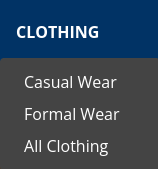
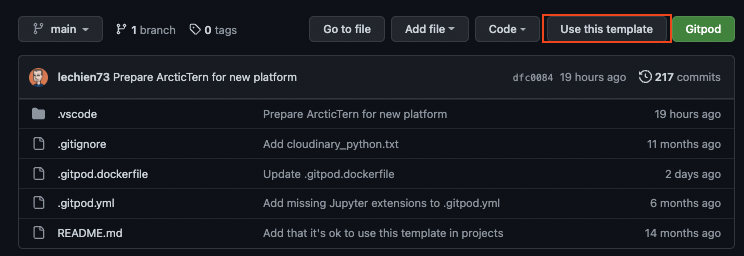
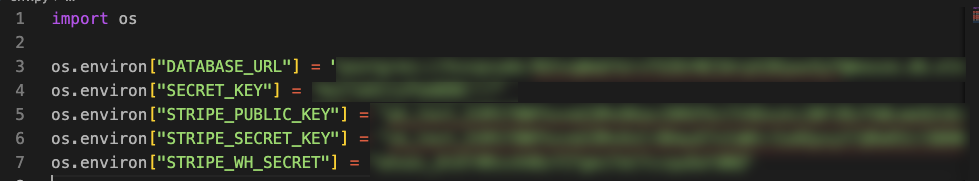

# **HandCraft**
HandCraft is an e-commerce store specializing in selling all kinds of handmade items, from accessories to jewelry, art, collectibles, formal and casual wear, and home & living items, including delicate furniture of all sorts.

HandCraft exclusively sells handmade products and offers a wide selection at various price points to appeal to a large group of potential clients.

This site was created for Portfolio Project #5 (E-Commerce Applications Portfolio Project) as part of the Diploma in Full Stack Software Development at the [Code Institute](https://www.codeinstitute.net).

[View live website here](https://project-5-39f95920fba3.herokuapp.com/)

# Table of Content

* [**Project**](<#project>)
    * [Objective](<#objective>)
    * [Site Users Goal](<#site-users-goal>)
    * [Site Owners Goal](<#site-owners-goal>)
    * [Business Model](<#business-model>)
    * [Marketing Techniques](<#marketing-techniques>)
    * [Project Management](<#project-management>)

* [**User Experience (UX)**](<#user-experience-ux>)
    * [User Stories](<#user-stories>)
    * [Site Structure](<#site-structure>)
    * [Design Choices](<#design-choices>)

* [**Existing Features**](<#existing-features>)
    * [Top Bar](<#top-bar>)
    * [Navigation](<#navigation>)
    * [Home](<#home>)
    * [Products](<#products>)
    * [Shopping Cart](<#shopping-cart>)
    * [Secure Checkout](<#secure-checkout>)
    * [Order Confirmation](<#order-confirmation>)
    * [Confirmation Emails](<#confirmation-emails>)
    * [Sign Up](<#sign-up>)
    * [Sign In](<#sign-in>)
    * [Password Reset](<#password-reset>)
    * [Sign Out](<#sign-out>)
    * [Footer](<#footer>)
    * [Visual Feedback To The User](<#visual-feedback-to-the-user>)

* [**Features Left To Implement**](<#features-left-to-implement>)

* [**Technologies Used**](<#technologies-used>)
    * [Languages](<#languages>)
    * [Frameworks & Software](<#frameworks--software>)
    * [Libraries](<#libraries>)

* [**Testing**](<#testing>)
    * [Testing User Stories](<#testing-user-stories>)
    * [Code Validation](<#code-validation>)
    * [Additional Testing](<#additional-testing>)
    * [Known Bugs](<#known-bugs>)
* [Deployment](<#deployment>)
* [Credits](<#credits>)
* [Acknowledgements](<#acknowledgements>)

# **Project**

## Objective
I decided to build an online store focused on handmade products because I believe that most people can identify with handmade items and are willing to buy them, knowing they are getting products crafted with human time and expertise to ensure high quality and longevity. I aimed to create the site as authentically as possible while demonstrating my knowledge of the Django framework, Python, JavaScript, CSS, and HTML.

## Site Users Goal
The users of 'HandCraft' are a diverse group of people with various interests and desires, including art lovers, collectors, fashion enthusiasts, jewelry lovers, and more. The site provides a unique platform where users can find rare and delicate custom-made products all in one place. HandCraft offers items that are seldom found elsewhere, providing users the convenience of ordering them from the comfort of their own homes.

## Site Owners Goal
The goal of the site owner is to create a platform where users can intuitively purchase handcrafted items of all sorts, combining multiple genres in one place.

## Business Model
To know which business model that fits the needs and requirements for a business is of course very important. HandCraft is a business that sells the products directly to the end users through direct selling via the HandCraft webpage. The buyers are private consumers which makes HandCraft business model a B2C (Business To Consumer)-model. This means that everytime a HandCraft customer buys something from the webpage a B2C transaction is completed. To be able to implement a B2C eCommerce model in a successful way it is very important to have a quickly adjustable platform to be able to adapt to the customers if needed. The HandCraft webpage is a highly adjustable platform which makes fast adjustments quite easy. But to have a solid platform is not everything, of course there is a need for good marketing techniques to be able to reach out to new customers and engage the existing ones.

## Marketing Techniques
There are a lot of different marketing techniques out there. For HandCraft there has from the start been some areas that builds the foundation of the HandCraft trademark, and also sets the prerequisites to reach the customers.

* **Optimize For Mobile Devices**

In a world where most of the people visits the web from a mobile device it is very important that the site looks good on mobiles and tablets. The HandCraft site is fully responsive which means that it takes into account whether the customer uses a mobile or desktop device.

* **The Website Layout**

The HandCraft website is easy to navigate and have an intuitive design which makes it easy for the customer to find relevant information and make a purchase without a hassle.

* **Rate content**

On the HandCraft site, there is a Customer Review section that displays user ratings below each product. This helps the HandCraft team better understand the desires and needs of their customers and can serve as an indicator for adding new products to the stock. This makes it possible to offer more relevant products in the future that better fit user needs. HandCraft's ambition is for customers to visit our site because they want to, not because we want them to.

* **Facebook (social media marketing)**

Social Media marketing is a great tool if it's done in the right way. HandCraft has a presence on social media through Facebook. It helps HandCraft to communicate with both existing customers but also potential new ones. Through the social media platforms HandCraft can create engagement, interact on a broad level and maintain brand recognition. For HandCraft the product sale is being made on the site why it is very important to use the social media platforms to boost traffic to the website (i.e. when a new collection has been published or when the product of the month has been released). For now HandCraft only focuses on organic growth but will most likely start with payed ads to target specific customer groups in the future.

View the Facebook page at: [HandCraft Facebook page](https://www.facebook.com/profile.php?id=61563089110829)

<details><summary><b>HandCraft - Facebook</b></summary>


</details><br/>

<details><summary><b>HandCraft - Facebook 2</b></summary>


</details><br/>

* **Search Engine Optimization (SEO)**
Search Engine Optimization is a very important method to improve the ranking on search-engines (and has a high Return Of Investement if done right). The ambition is that HandCraft includes relevant, professional and reliable content and offers a hassle free experience for the site user. Descriptive Meta Tags have been implemented on the site after a brainstorming session (and use of [Wordtracker](https://www.wordtracker.com/)). The final description / words that have been used can be seen below:

    * Meta Description - Explore HandCraft's unique collection of handmade goods across various genres. Discover exquisite pieces for your home, wardrobe, and more. Shop now and experience the artistry firsthand.

    * Meta Keywords - HandCraft, handmade goods, unique items, home decor, clothing, jewelry, art, collectibles, accessories

The site also includes a sitemap.xml and robots.txt to make sure that the search engines can find and crawl the pages on the site.

[Back to top](<#table-of-content>)

## Project Management

### Github Board
For this project I have used the project board in GitHub to have control over my project. Github was useed to plan, create and organise my user stories.

<details><summary><b>Github Board</b></summary>


</details><br/>

[Back to top](<#table-of-content>)

### Database Schema

Models used (besides standard user model) in this project are:

**App: Checkout**
* **Order** - Manages all customer orders. Holds delivery information but also generates i.e. order numbers and update totals. Has a foreign connection to the user_profile model.
* **OrderLineItem** - Tracks each item in an order, linked to both the Order and Product models.

**App: Products**
* **Rating** - Manages star ratings and reviews.
* **Category** - Manages product categories.
* **Product** - Manages product details like price, name, category, and user wishlists. Connected to the User model for wishlist tracking.

**App: user_profiles**
* **UserProfile** -  Manages delivery information and order history, with functionality for profile creation or updates.
* **Address** - Manages saved addresses and default delivery address, allowing up to five addresses with one set as default.

# **User Experience (UX)**

## User Stories
Below the user stories for the project are listed to clarify why particular feature matters. These will then be tested and confirmed in the [Testing](<#testing>) section.

### Viewing And Navigation

|  | | |
|:-------:|:--------|:--------|
| As a Customer | I want to view a list of products so that I can read more about it and purchase it | &#9745; |
| As a Customer | I want to click on a specific product so that I can view its details like price, description, product rating, sizes and image | &#9745; |
| As a Customer | I want to view detailed reviews related to a specific product, so that I can gain insights into the product's satisfaction level, thereby aiding me in making an informed purchase decision | &#9746; |
| As a Customer  | I want to view the total of my purchases at any time so that I can keep track of my expenses | &#9745; |
| As a Site User | I want to easily navigate through the website and view a comprehensive list of products, so that I can quickly find what I'm looking for and enjoy a seamless shopping experience. | &#9745; |
| As a Site User | I want to receive visual feedback when interacting with content so that I can be confident in how I have interacted with the page| &#9745; |


### Registration And User Accounts
|  | | |
|:-------:|:--------|:--------|
| As a Site User | I want to register an account so that I can have a personal account and access my profile | &#9745; |
| As a Site User | I want to have my own user profile so that I can view my personal order history, see and manage my own reviews, and update my contact/payment/delivery information | &#9745; |
| As a Site User | I want to log out from the site so that I can feel secure that nobody can access my information | &#9745; |


### Sorting And Searching
|  | | |
|:-------:|:--------|:--------|
| As a Customer | I want to sort the list of all products in different ways so that I can identify the best-rated, best prices, and products based on category| &#9745; |
| As a Customer | I want to sort a specific category of products so that I can identify the best rated, best prices or just sort the products by name | &#9745; |
| As a Customer | I want easily get information about specific products by typing keywords into a search bar so that I can find what I am looking for quickly | &#9745; |

### Purchasing And Checkout
|  | | |
|:-------:|:--------|:--------|
| As a Customer | I want to easily choose the quantity of a product and size if applicable when purchasing it so that I ensure I get the correct product | &#9745; |
| As a Customer | I want to easily view the items in my cart to be purchased so that I can see the total cost and all the items I am about to receive  | &#9745; |
| As a Customer | I want to easily adjust the amount of products in my cart so that I can change the products quantity and size before checking out | &#9745; |
| As a Customer | I want to set up my payment details in an intuitive way so that the checkout process is quick and convenient | &#9745; |
| As a Customer | I want to a intuitive and secure way of interacting with the site so that I feel convenient while providing all necessary information needed for purchase | &#9745; |
| As a Customer | I want to view an order confirmation and summery after checkout so that I can ensure that the purchase succeeded with the desired Products and delivery Information | &#9745; |
| As a Customer | I want to receive an email confirmation after the checkout process is done so that I can keep the information for future use if needed | &#9745; |
| As a Customer | I want to receive an email confirmation when my order changes so that I get relevant information about my order | &#9746; |
| As a Customer | I want to use a promotion code so that I can get a better deal | &#9746; |
| As a Customer | I want to add products to a wishlist so that I can view and purchase them later, with a visual element indicating how many items are in my wishlist | &#9745; |
| As a Customer | I want to easily sign up for the newsletter so that I can stay informed about the latest updates, promotions, and news without missing out. | &#9745; |

### Site Admin

|  | | |
|:-------:|:--------|:--------|
| As a Site Admin | I want to search, create, update, and delete product posts so that I can manage my product content | &#9745; |
| As a Site Admin | I want to log out from the site so that I can feel safe that nobody can access my information | &#9745; |
| As a Site Admin | I want to create draft product posts so that I can finish writing the content later | &#9746; |
| As a Site Admin | I want to access an admin area so that I can manage my Websites content | &#9745; |
| As a Site Admin | I want to get visual feedback when interacting with the content so that I can be sure how I have interacted with the page | &#9745; |

[Back to top](<#table-of-content>)

## Site Structure

The website's structure is designed to ensure a seamless user experience with clear navigation and a logical flow of information. Key pages include:

   * **Home** - Highlights featured products and promotions.
   * **Product** Listing - Displays products with options to filter and sort.
   * **Product Detail** - Provides detailed information about each product.
   * **Shopping Cart** - Allows users to view and modify items in their cart.
   * **Checkout** - Facilitates secure payment and order completion.
    Order Confirmation - Confirms successful purchases and provides order details.
   * **User Profile** - Manages account details, order history, and addresses.
   * **Sign Up/Sign In** - Allows user registration and authentication.
   * **Password Reset** - Enables users to recover or change their passwords.a nice experience.

Read more about the different pages in the [Features](<#features>) section.

[Back to top](<#table-of-content>)

## Design Choices

* ### Color Scheme

The color scheme is chosen to reflect the artisanal and handcrafted nature of the products, creating a warm and inviting atmosphere. The online service [Coolors](https://coolors.co/) was used to choose the color scheme.


* ### Typography
The color scheme for the 'HandCraft' site revolves around Orange [#D07C3F], which is primarily used in the top bar and footer. Additional colors used alongside black and white are Midnight Blue [#003366] and Caput Mortuum [#fff4d2]. Orange serves as the main background color. I believe these colors create a warm ambiance while maintaining a clean and professional look. The colors also offer good readability and contrast.  I used the online service [Coolors](https://coolors.co/) to choose the color scheme.


[Back to top](<#table-of-content>)

# **Features**
The features of the site are listed below.

## **Existing Features**

### **Top Bar**
The Top bar includes essential site links, such as the cart icon, user profile access with navigation options and a search bar for searching for specific products or keywords. It is designed to be accessible from any page for quick access to key functionalities.

<details><summary><b>Top Bar</b></summary>


</details><br/>

### **Navigation**
The navigation menu includes links to main sections of the site, including Home, Products, and User Profile. It is designed for easy access and quick browsing.

**Navigation - User Not Logged In**
* **All Products** - The Products page displays a comprehensive list of items, with options to filter by category, price, and search keywords. Each product includes an image, name, and brief description.
* **Clothes** - Lets the user sort/view the products by the subcategories **Casual Wear**, **Formal Wear**, **All Clothes**.
* **Home & Living** - Lets the user sort/view the products by the subcategories **Bed & Bath**, **Kitchen & Dinning**, **Livingroom**, **All Clothes**.
* **Accessories** - Lets the user sort/view the products by the categories**Accessories** which render a list of accessoires.
* **Art & Collectibles** -Lets the user sort/view the products by the subcategories **Art**, **Collectibles**, **Art & Collectibles**.
* **Juwelery** - Lets the user sort/view the products by the categories**Accessories** which render a list of accessoires.
* **My Account** - Lets the user either **register an account** or **login**
* **Cart** - Views the total cost of the cart when the user starts adding to it. When the user clicks on it the **cart** template opens up.
* **Search bar** - Lets the user search for products on the page.

<details><summary><b>Navigation - User Not Logged In</b></summary>





</details><br/>

**Navigation - User Logged In**

When an ordinary user is logged in the **My Account** gets more available options, **My Profile** and **Wishlist**.

**My Profile** - On the profile page, users can update their delivery information and view their order history. They can save up to five addresses, with the option to set one as the default. This feature allows users to easily deliver products to their current location, increasing the likelihood of purchases while on vacation, at friends' places, in the office, etc. The profile page also includes a user review section that displays all reviews published by the user, with a 'Manage Reviews' button below.

* **Wishlist** - The Wishlist displays the products that the user has added, presented in the same format as they appear in the category or all-products section. When a product is added to the Wishlist, a small number within a red dot will appear, indicating how many items are currently in the Wishlist at all times.

<details><summary><b>Navigation - My Account - User Logged In</b></summary>


</details><br/>

<details><summary><b>Navigation - My Account - My Profile - Empty</b></summary>


</details><br/>

<details><summary><b>Navigation - My Account - My Profile - With Delivery Information and a saved addresses</b></summary>


</details><br/>

<details><summary><b>Navigation - My Account - My Profile - With Delivery Information and a saved addresses</b></summary>


</details><br/>

<details><summary><b>Navigation - My Account - My Profile - User Reviews and Order History</b></summary>


</details><br/>

<details><summary><b>Navigation - My Account - My Wishlist</b></summary>


</details><br/>

<details><summary><b>Navigation - My Account - My Wishlist - Removal Confirmation</b></summary>


</details><br/>

**Navigation - Admin Logged In**

When a superuser / administrator is logged in the **My Account** gets more avilable options, **Product Management**, **My Profile** and **Logout**

<details><summary><b>Navigation - My Account - Admin Logged In</b></summary>


</details><br/>

* **Product Management** - This page provides an interface for administrators to add and submit new products to the store.

<details><summary><b>Navigation - Admin Logged In - Product Management</b></summary>


</details><br/>

<details><summary><b>Navigation - Admin Logged In - Product with Edit and Delete buttons</b></summary>


</details><br/>

* **Edit Product** -  Each product has Edit and Delete buttons that appear when an admin is logged in. The Edit button is represented by a pen icon within a yellow square button, while the Delete button is represented by a trash icon within a red square button. When the admin clicks the Edit button, the product form will open and populate with the product's details, allowing for modifications. 

<details><summary><b>Navigation - Admin Logged In - Product Management - Edit</b></summary>


</details><br/>

* **Delete Product** -  When an admin clicks the trash icon to delete a product, a modal will open to confirm the deletion. This extra step helps prevent accidental deletion of products.

<details><summary><b>Navigation - Admin Logged In - Product Management - Delete</b></summary>


</details><br/>

### **Landing Page**
The home page features a background image of a person drawing and various crafting tools on a table. It includes a centered introductory text reading "Prepare to be enchanted," a "Shop Now" button, and a footer with social media links, two images, and the latest blog posts.

<details><summary><b>Landing Page</b></summary>


</details><br/>

### **Products**
The **Products** page displays items based on the user's selection from the submenus: **All Products**, **Clothes**, **Home & Living**, **Accessories**, **Art & Collectibles** or **Juwelery** The layout remains consistent across different subcategories, showcasing various products. If there are many products in a subcategory, an up arrow will appear in the bottom right corner, allowing users to quickly return to the top of the page.
<br>
In the example provided, products are sorted alphabetically (A-Z). Clicking on a product will navigate to its detailed product page. If an admin is logged in, they can access the product management page to edit products from both the product overview and the product detail pages.

<details><summary><b>Product View</b></summary>


</details><br/>

* **Product Detail** - On the product detail page, users can view a brief description of the product and add it to their wishlist using the Add to Wishlist button. If the product is available in multiple sizes, a size selection option will be displayed. Below the Add to Wishlist button, users will find a star rating system where they can rate and review the product. Clicking on the desired number of stars opens a modal where users can submit their rating and provide a review. This allows other users to see experiences and opinions about the product. Logged-in users will also see an edit (pen icon) and delete (trash icon) button to manage their reviews directly from the product detail page.

<details><summary><b>Product Detail</b></summary>


</details><br/>

<details><summary><b>Product Detail - Size</b></summary>


</details><br/>

**Rating Form**
The user can rate each product on the corresponding product detail page with 1 to 5 stars. I encountered an issue when trying to highlight the stars from left to right, which would be more intuitive for the user and provide a better UX. However, I was only able to get them to highlight from right to left.


<details><summary><b>Product Detail - Rating Form</b></summary>


</details><br/>

<details><summary><b>Product Detail - Review Modal</b></summary>


</details><br/>

<details><summary><b>Product Detail - Review Container</b></summary>


</details><br/>


### **Shopping Cart**
When a site user adds products by pressing the **ADD TO CART** button, the items are stored in the shopping cart. This cart can be accessed via the bag icon in the navigation menu. In the shopping cart area, users can update or delete the products they’ve added. The cart provides a clear overview of the total cost of the products, including and excluding delivery charges. From this view, the user can choose to either continue shopping or proceed to the secure checkout page.

<details><summary><b>Shopping Cart Summery</b></summary>


</details><br/>

<details><summary><b>Shopping Cart</b></summary>


</details><br/>

### **Secure Checkout**
On the secure checkout page, users fill out a form with delivery and payment details to complete their order. If logged in, users have the option to save their information to their profile for future purchases. If not logged in, they are given the option to register or sign in. The page also includes an order summary, allowing users to review their purchase. If something appears incorrect, they can adjust the cart before proceeding. Once satisfied with the order summary, users can finalize their purchase by clicking the **Complete Order** button, which processes the payment through Stripe.

<details><summary><b>Secure Checkout</b></summary>


</details><br/>

<details><summary><b>Order Processing</b></summary>


</details><br/>

### **Order Confirmation**
If everything goes according to plan and the webhooks between Stripe and the site are functioning correctly, the user will be redirected to an order confirmation page. Additionally, a confirmation email will be sent to the user’s registered email address.

<details><summary><b>Order Confirmation</b></summary>


</details><br/>

### **Confirmation Email**
When the order is confirmed the user gets an confirmation e-mail to the registered e-mail.

<details><summary><b>Confirmation Email</b></summary>


</details><br/>

### **Sign Up**
If the site visitor has no registered user at Kollektiv Fem they can sign up.

<details><summary><b>Register</b></summary>


</details><br/>

### **Register**
On this page the user can sign in to HandCraft.

<details><summary><b>Sign In</b></summary>


</details><br/>

### **Password Reset**
If the user has forgotten the password they can ask for a password reset through this page.

<details><summary><b>Password Reset</b></summary>


</details><br/>


### **Sign Out**
When the user clicks sign out in the menu bar a confirmation page is being showed so that the user don't accidently sign out.

<details><summary><b>Sign Out</b></summary>


</details><br/>

### **Footer**
The Footer displays the name of the webstore's creator, followed by the text <i>"Follow us on:"</i> and links to social media platforms such as Facebook, YouTube, Instagram, and Twitter. The Facebook link directs users to the specific Facebook business page created for this project, while the other links lead to the general homepages of the respective social media networks.

<details><summary><b>Footer</b></summary>


</details><br/>

### **Newsletter**:
I chose to position the Mailchimp newsletter signup form at the bottom of the page, where the footer used to be. In this location, the popup overlaps the footer if the user doesn’t close it. Embedding the form directly in the footer increased its height, negatively impacting the overall design and reducing its visual appeal.

While this solution isn't ideal for newsletter implementation since it compromises the visibility of the footer the newsletter popup only appears once per day. This ensures that the footer will still be visible to users once they subscribe or close the popup.

I tested various options, including embedded forms, a dedicated signup page, and a popup. The popup at the bottom of the site proved to be the most visually appealing and offered the best compromise for this project.

Once a user subscribes to the newsletter, it will be sent automatically to the provided email address. Please note that this process is not immediate, and it may take a short while for Mailchimp to process the data and send the email to the customer.


<details><summary><b>Newsletter Sign Up Form</b></summary>


</details><br/>

<details><summary><b>Newsletter Success Message</b></summary>


</details><br/>


<details><summary><b>Newsletter</b></summary>


</details><br/>


### **Visual Feedback To The User**
The sites incorporates flash messages when an action has been performed (i.e. delete/update/add to cart-actions). Examples of this in the screenshots below.

<details><summary><b>Confirmation Messages</b></summary>


</details><br/>

### Features Left to Implement

* **Searchbar in Product Management** - Implement a search bar on the Product Management page that allows admins to search for specific products. Below the search bar, display a container listing all products where admins can search, edit, delete products, and manage user reviews. where the admin can search, edit, delete products and also user reviews.
* **Promotion Codes** - Introduce a feature that allows logged-in users to apply a promotion code during checkout, enabling them to receive discounts or special offers.
* **Admin Dashboard** - Develop an admin area that provides general information such as the number of logged-in users, total number of products, recent activity, and other key metrics.
* **Enhanced Email Functionality** - Expand email capabilities by sending out notifications when an order has been processed or handled, in addition to the existing order confirmation emails.

[Back to top](<#table-of-content>)

# Technologies Used

## Languages

* [Python](https://en.wikipedia.org/wiki/Python_(programming_language)) - Provides the functionality for the site.
* [HTML5](https://en.wikipedia.org/wiki/HTML) - Provides the content and structure for the website.
* [CSS3](https://en.wikipedia.org/wiki/CSS) - Provides the styling for the website.
* [JavaScript](https://en.wikipedia.org/wiki/JavaScript) - Provides interactive elements of the website

## Frameworks & Software
* [Bootstrap](https://getbootstrap.com/) - A CSS framework that helps building solid, responsive, mobile-first sites
* [Django](https://www.djangoproject.com/) - A model-view-template framework used to create the Review | Alliance site
* [Github](https://github.com/) - Used to host and edit the website.
* [GitBash](https://en.wikipedia.org/wiki/Bash_(Unix_shell)) - Terminal in [Gitpod](https://www.gitpod.io) used to push changes to the GitHub repository.
* [Heroku](https://en.wikipedia.org/wiki/Heroku) - A cloud platform that the application is deployed to.
* [Lighthouse](https://developer.chrome.com/docs/lighthouse/overview/) - Used to test performance of site.
* [Responsive Design Checker](https://www.responsivedesignchecker.com/) - Used for responsiveness check.
* [Wave Web Accessibility Evaluation Tool](https://wave.webaim.org/) - Used to validate the sites accessibility.
* [a11y Color Contrast Accessibility Validator](https://color.a11y.com/Contrast/) - Used to test color contrast on the site
* [Graph Models](https://django-extensions.readthedocs.io/en/latest/graph_models.html) - Used to create a *.dot file of all models in the project.
* [dreampuf](https://dreampuf.github.io/GraphvizOnline/) - Creates visually appealing database diagrams of *.dot files.
* [Favicon](https://favicon.io/) - Used to create the favicon.
* [VSCode](https://code.visualstudio.com/) - Used to create and edit the site.
* [Google Chrome DevTools](https://developer.chrome.com/docs/devtools/) - Used to debug and test responsiveness.
* [Amazon Web Services](https://aws.amazon.com/) - A service that hosts all static files and images in the project.
* [HTML Validation](https://validator.w3.org/) - Used to validate HTML code
* [CSS Validation](https://jigsaw.w3.org/css-validator/) - Used to validate CSS code
* [CI Python Linter](https://pep8ci.herokuapp.com/) - Used to lint the Python code in the project
* [JSHint Validation](https://jshint.com/) - Used to validate JavaScript code
* [Mailchimp](https://mailchimp.com/) - Used for the newsletter functionality on the site.
* [Favicon](https://favicon.io/) - Used to create the favicon.

## Libraries

[Back to top](<#table-of-content>)

The libraries used in this project are located in the requirements.txt file and have been documented below

* [asgiref](https://pypi.org/project/asgiref/) - ASGI is a standard for Python asynchronous web apps and servers to communicate with each other, and positioned as an asynchronous successor to WSGI.
* [backports.zoneinfo](https://pypi.org/project/backports.zoneinfo/) - Exposes the backports.zoneinfo module, which is a backport of the zoneinfo module.
* [boto3](https://boto3.amazonaws.com/v1/documentation/api/latest/index.html) - Is used to create, configure, and manage AWS services, such as Amazon Elastic Compute Cloud (Amazon EC2) and Amazon Simple Storage Service (Amazon S3).

* [botocore](https://botocore.amazonaws.com/v1/documentation/api/latest/index.html) - Botocore is a low-level interface to a growing number of Amazon Web Services. Botocore serves as the foundation for the AWS-CLI command line utilities.
* [dj-database-url](https://pypi.org/project/dj-database-url/) - This simple Django utility allows you to utilize the 12factor inspired DATABASE_URL environment variable to configure your Django application.
* [Django](https://pypi.org/project/Django/) - Django is a high-level Python web framework that encourages rapid development and clean, pragmatic design.
* [django-allauth](https://pypi.org/project/django-allauth/) - Integrated set of Django applications addressing authentication, registration, account management as well as 3rd party (social) account authentication.
* [django-countries](https://pypi.org/project/django-countries/) - A Django application that provides country choices for use with forms, flag icons static files, and a country field for models.
* [django-crispy-forms](https://pypi.org/project/django-crispy-forms/) - Used to integrate Django DRY forms in the project.
* [django-extensions](https://pypi.org/project/django-extensions/) - Django Extensions is a collection of custom extensions for the Django Framework.
* [django-storages](https://django-storages.readthedocs.io/en/latest/) - django-storages is a collection of custom storage backends for Django.
* [gunicorn](https://pypi.org/project/gunicorn/) - Gunicorn ‘Green Unicorn’ is a Python WSGI HTTP Server for UNIX. It’s a pre-fork worker model ported from Ruby’s Unicorn project. The Gunicorn server is broadly compatible with various web frameworks, simply implemented, light on server resource usage, and fairly speedy.
* [jmespath](https://pypi.org/project/jmespath/) - JMESPath (pronounced “james path”) allows you to declaratively specify how to extract elements from a JSON document.
* [oauthlib](https://pypi.org/project/oauthlib/) - OAuthLib is a framework which implements the logic of OAuth1 or OAuth2 without assuming a specific HTTP request object or web framework.
* [Pillow](https://pypi.org/project/Pillow/) - The Python Imaging Library adds image processing capabilities to your Python interpreter.
* [psycopg2](https://pypi.org/project/psycopg2/) - Psycopg is the most popular PostgreSQL database adapter for the Python programming language.
* [pydot](https://pypi.org/project/pydot/) - is an interface to Graphviz that can parse and dump into the DOT laungage.
* [PyJWT](https://pypi.org/project/PyJWT/) - A Python implementation of RFC 7519.
* [python3-openid](https://pypi.org/project/python3-openid/) - OpenID support for modern servers and consumers.
* [pytz](https://pypi.org/project/pytz/) - This is a set of Python packages to support use of the OpenID decentralized identity system in your application, update to Python 3
* [requests-oauhlib](https://pypi.org/project/requests-oauthlib/) - P    rovides first-class OAuth library support for Requests.
* [s3transfer](https://pypi.org/project/s3transfer/)- S3transfer is a Python library for managing Amazon S3 transfers. This project is maintained and published by Amazon Web Services.
* [sqlparse](https://pypi.org/project/sqlparse/) - sqlparse is a non-validating SQL parser for Python. It provides support for parsing, splitting and formatting SQL statements.
* [stripe](https://pypi.org/project/stripe/) - A Python library for Stripe’s API.

# Testing

## Testing User Stories

### Viewing And Navigation

* As a Customer I want to view a list of products so that I can read more about it and purchase it.

    * All product pages are showing unpaginated a list of Products, with image description, average rating and a Wishlist button.

* As a Customer I want to click on a specific product so that I can view its details like price, description, product rating, sizes and image.

    * At the top of the site there is a navigation bar with links that lists products based on categories and subcategories within a dropdown menu, sorting or through a search query. When a user clicks on a product, it can be viewed in Detail on the Product Detail page.

* As a Customer I want to view detailed reviews related to a specific product, so that I can gain insights into the product's satisfaction level, thereby aiding me in making an informed purchase decision

    * When clicking on a Product and viewing it on the product detail page, there is a **Costumer Review Card** below the Star rating form, where all Ratings with Reviews from Costumers will be displayed.

* As a Customer I want to view the total of my purchases at any time so that I can keep track of my expenses

    * The Order History within the users Profile is showing all transactions made with all informations such as Order Number, Date, Item Name and amount bought and the Order Total which displays the total price for the items bought.

* As a Site User, I want to easily navigate through the website and view a comprehensive list of products, so that I can quickly find what I'm looking for and enjoy a seamless shopping experience.
    * When scrolling down on the products sites there will appear a **up arrow** button in the right bottom corner which will bring the user back to the top of the site. This Design was choosen to encourage the potential Costumers to browse on the site and spend more time discovering the products avaible to them and possibly trigger a purchase threw this.

* As a Site User I want to receive visual feedback when interacting with content so that I can be confident in how I have interacted with the page.
    * When the site user performs actions on the sites flash messages shows (i.e. delete/update/add to cart/ actions).

* As a Customer, I want to easily sign up for the newsletter so that I can stay informed about the latest updates, promotions, and news without missing out.
    * When the site user enter his email address within the newsletter sign up Pop Up form on the bottom of the page and click on the Subscribe button he gets a success message and a Newsletter per E-Mail.

### Registration And User Accounts

* As a Site User I want to register an account so that I can have a personal account and access my profile.
    * In the navigation bar the user can click the Register link in the My Account menu sign up for a new account. When this is done the user can access the personal account.

* As a Site User I want to have my own user profile so that I can view my personal order history, see and manage my own reviews, and update my contact/payment/delivery information.

    * When the user has created an account and is logged in the menu My Profile in the menu takes them to a profile page were they can set theire default delivery Address, save up to five addresses to theire profile, set them as default, delete or edit them and view their own Reviews within a User Review card, where each Review have a **Manage Review** button below the actual review, and when clicked will redirect the user to the product detail page.

* As a Site User I want to log out from the site so that I can feel secure that nobody can access my information.
    * When the user is logged in it is possible to choose the 'Logout'-option in the navigation menu.

### Sorting And Searching

*  As a Customer I want to sort the list of all products in different ways so that I can identify the best-rated, best prices, and products based on category.
    * At the top of the site there is a navigation bar with links that lists products based on categories, sorting or through a search query. When rendering a subcategory in the category menu in the Navbar or render the **All Products** page there will be also in the right top corner a drop down menu where the user can sort products by price, rating, alpabetic order, name, category, etc.

* As a Customer I want to sort a specific category of products so that I can identify the best rated, best prices or just sort the products by name.--
    * At the top of the site there is a navigation bar with links that lists products based on categories, sorting or through a search query.

* As a Customer I want easily get information about specific products by typing keywords into a search bar so that I can find what I am looking for quickly
    *  Within the Top Bar there is a search bar in the center top of the page, which allow user to search for specific products or keywords.

### Purchasing And Checkout

* As a Customer I want to easily choose the quantity of a product and size if applicable when purchasing it so that I ensure I get the correct product.
    * On the product detail page the user can choose the quantity of a product and size.

* As a Customer I want to easily view the items in my cart to be purchased so that I can see the total cost and all the items I am about to receive.
    * The user can easily view the cart by clicking the cart icon in the top navigation bar.

* As a Customer I want to easily adjust the amount of products in my cart so that I can change the products quantity and size before checking out.
    * On the shopping cart page, which the user can reach by clicking the cart icon in the top navigation bar, it is easy to adjust the amount of products before checking out.

* As a Customer I want to set up my payment details in an intuitive way so that the checkout process is quick and convenient.
    * In the secure checkout page fill out easily a Address form, with credit card details at the bottom and checkout process quickly.

*  As a Customer I want to a intuitive and secure way of interacting with the site so that I feel convenient while providing all necessary information needed for purchase.
    * This is somehow subjective but the site has been build to 'radiate' a sense of professionality and stability.

*  As a Customer I want to view an order confirmation and summer after checkout so that I can ensure that the purchase succeeded with the desired Products and delivery Information.
    * When the checkout process is completed the user is taken to a confirmation success page with an order summery.

* As a Customer I want to receive an email confirmation after the checkout process is done so that I can keep the information for future use if needed.
    * When the checkout process is completed the user recieves a confirmation e-mail to the e-mail that has been registered in the checkout process.

* As a Customer I want to receive an email confirmation when my order changes so that I get relevant information about my order.
    * Not implemented yet

* As a Customer I want to add products to a wishlist so that I can view and purchase them later, with a visual element indicating how many items are in my wishlist.
    * On the all products pages and also on the product detail page the logged in user can add the specific product to their whislist and then access the wishlist from the 'Wishlist' icon within the Top Bar.

* As a Customer I want to use a promotion code so that I can get a better deal.
    * Not implemented yet

### Site Admin

* As a Site Admin I want to search, create, update, and delete product posts so that I can manage my product content.
    * When admin is logged the product management page can be reached through the 'My Account' -dropdown menu. This will allow the admin to add new products to the Webstore. When the admin want to edit or delete products, these buttons will appear at each products page.

* As a Site Admin I want to log out from the site so that I can feel safe that nobody can access my information.
    * When admin is logged in it is possible to choose the 'Log Out'-option in the navigation menu.

* As a Site Admin | I want to create draft product posts so that I can finish writing the content later.
    * Not implemented yet.

* As a Site Admin I want to access an admin area so that I can get a general understanding of i.e. number of users, number of products
    * Not implemented yet

* As a Site Admin | I want to get visual feedback when interacting with the content so that I can be sure how I have interacted with the page.
    * When the site user performs actions on the sites flash messages shows (i.e. delete/update/add to cart/ actions).

* As a Site Admin I want to create draft blog posts so that I can finish writing the content later.
    * Not implemented yet

[Back to top](<#table-of-content>)

## Code Validation
The code on the HandCraft site has been tested through W3C Markup Validation Service, W3C CSS Validation Service, CI Python Linter and JSHint.

### Markup Validation
Several errors and warnings were found during validation using the W3C HTML Validator. One of the more confusing issues involved list elements (<li>) not being allowed within navigation tags (<nav>), which persisted even after attempts to correct them. Upon further review, the issue did not seem to be caused by incorrect usage of list elements within navigation, as they were properly wrapped in unordered lists (<ul>).

Refer to the attached screenshot for a closer view of the specific errors and warnings.

<details><summary><b>HTML Validation Result</b></summary>


</details><br/>

[Back to top](<#table-of-content>)

### CSS Validation
When validating my own code the W3C CSS Validator reports no errors but 16 errors connected to Bootstrap were reported.

<details><summary><b>CSS Validation Result</b></summary>

**Base CSS**


--
**Profile CSS**


**Checkout CSS**


</details><br/>

[Back to top](<#table-of-content>)

### PEP Validation
CI Python Linter [Flake8](https://pypi.org/project/flake8/) was used to validate the Python code in the project. Following files have been validated:

**App cart**
* admin.py -  No errors reported
* apps.py - No errors reported
* contexts.py -  No errors or warnings reported
* urls.py -  No errors or warnings reported
* views.py -  No errors or warnings reported
* cart_tools.py - No errors or warnings reported

**App Blog**
* admin.py - No errors reported
* apps.py - No errors reported
* forms.py - No errors reported
* models.py - No errors reported
* urls.py - No errors reported
* views.py - No errors reported

**App Checkout**
* __init__.py - No errors reported
* admin.py - No errors reported
* apps.py - 'checkout.signals' imported but unused. I Havent quite understood this error cause i imported the signals within the ready function. I couldn't figure out the source of this error before submission.
* forms.py - No errors reported
* models.py - No errors reported
* signals.py - No errors reported
* urls.py - No errors reported
* views.py - 88:80: line too long (81 > 79 characters). Could not fix it before sending the project in for assessment.
* webhook_handler.py - 148:80: line too long (81 > 79 characters). I was not able to fix before sending in the project for assessment.
* webhooks.py - 40:80: E501 line too long (86 > 79 characters). I was not able to fix before sending in the project for assessment

**App Home**
* apps.py - No errors reported
* urls.py - No errors reported
* views.py - No errors reported

**App Products**
* admin.py - No errors reported
* apps.py - No errors reported
* forms.py - No errors reported
* models.py - No errors reported
* urls.py - No errors reported
* views.py - No errors reported

**App User Profile**
* apps.py - No errors reported
* forms.py - No errors reported
* models.py - No errors reported
* urls.py - No errors reported
* views.py - No errors reported

**other**
* custom_storages.py - No errors reported

[Back to top](<#table-of-content>)

### JavaScript Validation
The [JSHint](https://jshint.com/) validator results can be seen below:

No errors were returned when passing through JSHint but the test with no errors.

* stripe_elements.js in checkout app - No errors reported
* inline jscript in cart.html in cart app - No errors reported
* inline jscript in products.html in products app - No errors reported
* inline jscript in add_product.html in products app - No errors reported
* inline jscript in edit_product.html in products app - No errors reported
* inline jscript in includes/review_list.html in products app - No errors reported
* inline jscript in profile.html in user_profile app - No errors reported
* inline jscript in wishlist.html in user_profile app - No errors reported
* inline jscript in base.html in root templates - No errors reported
* inline jscript in footer.html in root templates - No errors reported

[Back to top](<#table-of-content>)

## Additional Testing

### Manual Testing

In addition to tests stated above I have performed a series of manual tests. Below the list of tests that has been conducted can be found.

| Status | **Main Website - User Logged Out - Navigation**
|:-------:|:--------|
| &check; | The free shipping treshold changes in the top bar changes when changing the treshold in the settings file
| &check; | Typing in a incorrect URL on the page loads the 404 error page
| &check; | Pasting page that needs authentication opens the sing in page or views a forbidden page
| &check; | Clicking the nav logo (HandCraft) loads the home page
| &check; | Clicking the By Price link in the Products menu lists all products and sorts them by price.
| &check; | Clicking the By Rating link in the Products menu lists all products and sorts them by rating.
| &check; | Clicking the By Name link in the Products menu lists all products and sorts them by name.
| &check; | Clicking the All Products link in the Products menu lists all products.
| &check; | Clicking the Clothes link in the Navbar menu and select the Subcategory 'Casual Wear' lists all Casual Wear related clothes.
| &check; | Clicking the Clothes link in the Navbar menu and select the Subcategory 'Formal Wear' lists all Formal Wear related clothes.
| &check; | Clicking the Clothes link in the Navbar menu and select the Subcategory 'All Clothes' lists all clothes.
| &check; | Clicking the Home & Living link in the Navbar menu and select the Subcategory 'Bed & Bath' lists all bed and bath related products.
| &check; | Clicking the Home & Living link in the Navbar menu and select the Subcategory 'Kitchen & Dining' lists all kitchen and dinning related products.
| &check; | Clicking the Home & Living link in the Navbar menu and select the Subcategory 'Livingroom' lists all livingroom related products.
| &check; | Clicking the Home & Living link in the Navbar menu and select the Subcategory 'All Homeware' lists all products within this category.
| &check; | Clicking the Accessories link in the Navbar menu lists all accessories.
| &check; | Clicking the Art & Collectibles link in the Navbar menu and select the Subcategory 'Art' lists all artisane products such as paintings.
| &check; | Clicking the Art & Collectibles link in the Navbar menu and select the Subcategory 'Collectibles' lists all collectibles within this category.
| &check; | Clicking the Art & Collectibles link in the Navbar menu and select the Subcategory 'Art & Collectibles' lists all products within this category.
| &check; | Clicking the Juwelery link in the Navbar menu lists all the juwelery.
| &check; | Clicking the Register link in the My Account menu loads the sign up page
| &check; | Clicking the Login link in the My Account menu loads the loginpage
| &check; | Clicking on the cart link in the menu bar loads the shopping cart page
| &check; | Input an empty query in the search box triggers an error messages and lists all products
| &check; | Input a valid query in the search box lists the correct products

| Status | **Main Website - User Logged Out - Products**
|:-------:|:--------|
| &check; | When using the sorting function below the product page headline the products are being sorted accordingly.
| &check; | A comprehensive list of products is shown to the user, where a 'arrow up' button will appear when scrolling down, which bring the user back to the top of the page
| &check; | Clicking on the image of a product loads the product detail page
| &check; | Clicking the 'Add To Wishlist' button on the product card, will add product to users wishlist
| &check; | The correct image and information for each product is being shown
| &check; | When adding products to the cart the total updates correctly to the right of the cart symbol in the menu.
| &check; | Clicking the Keep Shopping button on the product detail page lists all products
| &check; | Clicking the Add To cart button on the product detail page adds the quantity and size to the shopping cart and shows a flash message with the cart content and totals in the top right together (with a working link to the shopping cart)
| &check; | Clicking the Add To Wishlist button on the product detail page opens the sign-in page because wishlists only works for logged in users
| &check; | It's possible to change the quantity on the product detail page
| &check; | If the product has sizes a size dropdown is visible on the product detail page

| Status | **Main Website - User Logged Out - Shopping Cart**
|:-------:|:--------|
| &check; | The correct products and information are showing in the shopping cart (including correct sizes when product has size)
| &check; | When changing the quantity and click update the quantity updates
| &check; | When clicking the remove link the product is being removed from the shopping cart
| &check; | Clicking the Keep Shopping button on the product detail page lists all products
| &check; | Clicking the Secure Checkout button on the product detail page loads the secure checkout page

| Status | **Main Website - User Logged Out - Checkout**
|:-------:|:--------|
| &check; | The correct products, information and delivery amount are showing in the order summary (including correct sizes when product has size)
| &#10008; | The form validation is working except that the Full Name field can include numbers and the phone number field can include text
| &check; | In the bottom of the form an option log in or sign up is visible
| &check; | When clicking the Adjust cart Button the Shopping cart page loads
| &check; | The payment with card number is working correctly (tested with Stripe test numbers)
| &check; | The payment with card number that needs to be authenticated is working correctly (tested with Stripe test numbers). The authentication window is visible.

| Status | **Main Website - User Logged Out - Order Confirmation Page**
|:-------:|:--------|
| &check; | The correct products, information and delivery amount are showing in the order confirmation and an e-mail has been sent to the registered site user e-mail
| &check; | Webhooks are working and is confirmed in Stripe developer dashboard
| &check; | When clicking the Back To The Store button all products are being listed

| Status | **Main Website - Footer**
|:-------:|:--------|
| &check; | Clicking the Instagram link in the footer area opens Instagram in a new window
| &check; | Clicking the Youtube link in the footer area opens Instagram in a new window
| &check; | Clicking the Twitter link in the footer area opens Instagram in a new window
| &check; | Clicking the Facebook link in the footer area opens the Facebook business page created for this project in a new window


[Back to top](<#table-of-content>)

| Status | **Main Website - User Logged In - Navigation**
|:-------:|:--------|
| &check; | The free shipping treshold changes in the top bar changes when changing the treshold in the settings file
| &check; | Typing in a incorrect URL on the page loads the 404 error page
| &check; | Pasting page that needs authentication opens the sing in page or views a forbidden page
| &check; | Clicking the nav logo (HandCraft) loads the home page
| &check; | Clicking the By Price link in the Products menu lists all products and sorts them by price.
| &check; | Clicking the By Rating link in the Products menu lists all products and sorts them by rating.
| &check; | Clicking the By Name link in the Products menu lists all products and sorts them by name.
| &check; | Clicking the All Products link in the Products menu lists all products.
| &check; | Clicking the Clothes link in the Navbar menu and select the Subcategory 'Casual Wear' lists all Casual Wear related clothes.
| &check; | Clicking the Clothes link in the Navbar menu and select the Subcategory 'Formal Wear' lists all Formal Wear related clothes.
| &check; | Clicking the Clothes link in the Navbar menu and select the Subcategory 'All Clothes' lists all clothes.
| &check; | Clicking the Home & Living link in the Navbar menu and select the Subcategory 'Bed & Bath' lists all bed and bath related products.
| &check; | Clicking the Home & Living link in the Navbar menu and select the Subcategory 'Kitchen & Dining' lists all kitchen and dinning related products.
| &check; | Clicking the Home & Living link in the Navbar menu and select the Subcategory 'Livingroom' lists all livingroom related products.
| &check; | Clicking the Home & Living link in the Navbar menu and select the Subcategory 'All Homeware' lists all products within this category.
| &check; | Clicking the Accessories link in the Navbar menu lists all accessories.
| &check; | Clicking the Art & Collectibles link in the Navbar menu and select the Subcategory 'Art' lists all artisane products such as paintings.
| &check; | Clicking the Art & Collectibles link in the Navbar menu and select the Subcategory 'Collectibles' lists all collectibles within this category.
| &check; | Clicking the Art & Collectibles link in the Navbar menu and select the Subcategory 'Art & Collectibles' lists all products within this category.
| &check; | Clicking the Juwelery link in the Navbar menu lists all the juwelery.
| &check; | Clicking the Register link in the My Account menu loads the sign up page
| &check; | Clicking the Login link in the My Account menu loads the loginpage
| &check; | Clicking on the cart link in the menu bar loads the shopping cart page
| &check; | Clicking the My Profile link the My Account menu loads the my profile page
| &check; | Clicking the Wishlist-Heart icon loads the Wishlist with all products added to it by the user
| &check; | Clicking the Wishlist count updates accordingly when adding or removing products from wishlist
| &check; | Clicking on the cart link in the menu bar loads the shopping cart page
| &check; | Input an empty query in the search box triggers an error messages and lists all products
| &check; | Input a valid query in the search box lists the correct products

| Status | **Main Website - User Logged In - Products**
|:-------:|:--------|
| &check; | When using the sorting function below the product page headline the products are being sorted accordingly.
| &check; | A comprehensive list of products is shown to the user, where a 'arrow up' button will appear when scrolling down, which bring the user back to the top of the page
| &check; | Clicking on the image of a product loads the product detail page
| &check; | Clicking the 'Add To Wishlist' button on the product card, will add product to users wishlist
| &check; | The correct image and information for each product is being shown
| &check; | When adding products to the cart the total updates correctly to the right of the cart symbol in the menu.
| &check; | Clicking the Keep Shopping button on the product detail page lists all products
| &check; | Clicking the Add To cart button on the product detail page adds the quantity and size to the shopping cart and shows a flash message with the cart content and totals in the top right together (with a working link to the shopping cart)
| &check; | Clicking on the Wishlist-Heart icon load the users wishlist with all products added to it by the user
| &check; | Clicking on the Wishlist count updates accordingly when adding or removing products from the wishlist
| &check; | It's possible to change the quantity on the product detail page
| &check; | If the product has sizes a size dropdown is visible on the product detail page

| Status | **Main Website - User Logged In - Shopping Cart**
|:-------:|:--------|
| &check; | The correct products and information are showing in the shopping cart (including correct sizes when product has size)
| &check; | When changing the quantity and click update the quantity updates
| &check; | When clicking the remove link the product is being removed from the shopping cart
| &check; | Clicking the Keep Shopping button on the product detail page lists all products
| &check; | Clicking the Secure Checkout button on the product detail page loads the secure checkout page

| Status | **Main Website - User Logged In - Checkout**
|:-------:|:--------|
| &check; | The correct products, information and delivery amount are showing in the order summary (including correct sizes when product has size)
| &check; | It the user has updated the profile information the information is prefilled in the form.
| &check; | In the bottom of the form an option to save the delivery inforation to the users profile is visible
| &#10008; | The form validation is working except that the Full Name field accept integers and text.
| &check; | When clicking the Adjust cart Button the Shopping cart page loads
| &check; | The payment with card number is working correctly (tested with Stripe test numbers)
| &check; | The payment with card number that needs to be authenticated is working correctly (tested with Stripe test numbers). The authentication window is visible.

| Status | **Main Website - User Logged In - Order Confirmation Page**
|:-------:|:--------|
| &check; | The correct products, information and delivery amount are showing in the order confirmation and an e-mail has been sent to the registered site user e-mail
| &check; | Webhooks are working and is confirmed in Stripe developer dashboard
| &check; | When clicking the Back To The Store button all products are being listed

[Back to top](<#table-of-content>)

| Status | **Main Website - Admin Logged In - Navigation**
|:-------:|:--------|
| &check; | The free shipping treshold changes in the top bar changes when changing the treshold in the settings file
| &check; | Typing in a incorrect URL on the page loads the 404 error page
| &check; | Pasting page that needs authentication opens the sing in page or views a forbidden page
| &check; | Clicking the nav logo (HandCraft) loads the home page
| &check; | Clicking the By Price link in the Products menu lists all products and sorts them by price.
| &check; | Clicking the By Rating link in the Products menu lists all products and sorts them by rating.
| &check; | Clicking the By Name link in the Products menu lists all products and sorts them by name.
| &check; | Clicking the All Products link in the Products menu lists all products.
| &check; | Clicking the Clothes link in the Navbar menu and select the Subcategory 'Casual Wear' lists all Casual Wear related clothes.
| &check; | Clicking the Clothes link in the Navbar menu and select the Subcategory 'Formal Wear' lists all Formal Wear related clothes.
| &check; | Clicking the Clothes link in the Navbar menu and select the Subcategory 'All Clothes' lists all clothes.
| &check; | Clicking the Home & Living link in the Navbar menu and select the Subcategory 'Bed & Bath' lists all bed and bath related products.
| &check; | Clicking the Home & Living link in the Navbar menu and select the Subcategory 'Kitchen & Dining' lists all kitchen and dinning related products.
| &check; | Clicking the Home & Living link in the Navbar menu and select the Subcategory 'Livingroom' lists all livingroom related products.
| &check; | Clicking the Home & Living link in the Navbar menu and select the Subcategory 'All Homeware' lists all products within this category.
| &check; | Clicking the Accessories link in the Navbar menu lists all accessories.
| &check; | Clicking the Art & Collectibles link in the Navbar menu and select the Subcategory 'Art' lists all artisane products such as paintings.
| &check; | Clicking the Art & Collectibles link in the Navbar menu and select the Subcategory 'Collectibles' lists all collectibles within this category.
| &check; | Clicking the Art & Collectibles link in the Navbar menu and select the Subcategory 'Art & Collectibles' lists all products within this category.
| &check; | Clicking the Juwelery link in the Navbar menu lists all the juwelery.
| &check; | Clicking the Register link in the My Account menu loads the sign up page
| &check; | Clicking the Login link in the My Account menu loads the loginpage
| &check; | Clicking on the cart link in the menu bar loads the shopping cart page
| &check; | Clicking the My Profile link the My Account menu loads the my profile page
| &check; | Clicking the Wishlist-Heart icon loads the Wishlist with all products added to it by the user
| &check; | Clicking the Wishlist count updates accordingly when adding or removing products from wishlist
| &check; | Clicking on the cart link in the menu bar loads the shopping cart page
| &check; | Input an empty query in the search box triggers an error messages and lists all products
| &check; | Input a valid query in the search box lists the correct products
| &check; | Clicking the My Manage Products link the My Account menu loads the my product management page
| &check; | Clicking on the cart link in the menu bar loads the shopping cart page
| &check; | Input an empty query in the search box triggers an error messages and lists all products
| &check; | Input a valid query in the search box lists the correct products


| Status | **Main Website - Admin Logged In - Products**
|:-------:|:--------|
| &check; | When using the sorting function below the product page headline the products are being sorted accordingly.
| &check; | A comprehensive list of products is shown to the user, where a 'arrow up' button will appear when scrolling down, which bring the user back to the top of the page
| &check; | Clicking on the image of a product loads the product detail page
| &check; | Clicking the 'Add To Wishlist' button on the product card, will add product to users wishlist
| &check; | The correct image and information for each product is being shown
| &check; | When adding products to the cart the total updates correctly to the right of the cart symbol in the menu.
| &check; | Clicking the Keep Shopping button on the product detail page lists all products
| &check; | Clicking the Add To cart button on the product detail page adds the quantity and size to the shopping cart and shows a flash message with the cart content and totals in the top right together (with a working link to the shopping cart)
| &check; | Clicking on the Wishlist-Heart icon load the users wishlist with all products added to it by the user
| &check; | Clicking on the Wishlist count updates accordingly when adding or removing products from the wishlist
| &check; | It's possible to change the quantity on the product detail page
| &check; | If the product has sizes a size dropdown is visible on the product detail page
| &check; | The Product Cards have a Edit and Delete button when Admin is Logged in, where the Admin can udate and delete exisiting products
| &check; | The 'My Account' link will have a Product Management link in the dropdown when Admin is logged in, which will render the add product form, to add new products to the Webstore.

| Status | **Main Website - Admin Logged In - Product Management - Add Product**
|:-------:|:--------|
| &check; | The form validation is working and does not accept negative numbers on price field
| &check; | When not adding an image to the product a default image is being used instead automatically
| &check; | When clicking the Cancel button the standard product view is being loaded and all products are being listed
| &check; | When clicking the Add Product button the standard product view is being loaded viewing the newly added product

| Status | **Main Website - Admin Logged In - Product Management - Edit Product**
|:-------:|:--------|
| &check; | When clicking the Edit button within the Product card on the product pages or the product detail the Add Product Form will open and populate itself with the product details the Admin wishes to Edit. When doing this an Alert toast will be shown 'You are editing this product name'.
| &check; | When clicking the Cancel button the Add Product page is being loaded
| &check; | When clicking the Update button Product Detail page is being loaded viewing the newly updated product

| Status | **Main Website - Admin Logged In - Product Management - Delete Product**
|:-------:|:--------|
| &check; | When clicking the Delete Product button a warning modal is being loaded to get a second confirmation for the deletion of the product, to prevent deleting products accidently.

| Status | **Main Website - Admin Logged In - Shopping cart**
|:-------:|:--------|
| &check; | The correct products and information are showing in the shopping cart (including correct sizes when product has size)
| &check; | When changing the quantity and click update the quantity updates
| &check; | When clicking the remove link the product is being removed from the shopping cart
| &check; | Clicking the Keep Shopping button on the product detail page lists all products
| &check; | Clicking the Secure Checkout button on the product detail page loads the secure checkout page

| Status | **Main Website - Admin Logged In - Checkout**
|:-------:|:--------|
| &check; | The correct products, information and delivery amount are showing in the order summary (including correct sizes when product has size)
| &check; | It the user has updated the profile information the information is prefilled in the form.
| &check; | If the bottom of the form an option to save the delivery inforation to the users profile is visible
| &#10008; | The form validation is working except that the Full Name field accepts integers characters.
| &check; | When clicking the Adjust cart Button the Shopping cart page loads
| &check; | The payment with card number is working correctly (tested with Stripe test numbers)
| &check; | The payment with card number that needs to be authenticated is working correctly (tested with Stripe test numbers). The authentication window is visible.

| Status | **Main Website - Admin Logged In - Order Confirmation Page**
|:-------:|:--------|
| &check; | The correct products, information and delivery amount are showing in the order confirmation and an e-mail has been sent to the registered site user e-mail
| &check; | Webhooks are working and is confirmed in Stripe developer dashboard
| &check; | When clicking the Back To The Store button all products are being listed

| Status | **Main Website - Admin Logged In - Footer**
|:-------:|:--------|
| &check; | Clicking the Instagram link in the footer area opens Instagram in a new window
| &check; | Clicking the Youtube link in the footer area opens Youtube in a new window
| &check; | Clicking the Twitter link in the footer area opens Twitter in a new window
| &check; | Clicking the Facebook link in the footer area opens the Facebook business page in a new window

[Back to top](<#table-of-content>)

### Automated Testing
No automated testing has been done during this project.

### Responsiveness Test
The responsive design tests were carried out manually with [Google Chrome DevTools](https://developer.chrome.com/docs/devtools/) and [Responsive Design Checker](https://www.responsivedesignchecker.com/).

| Desktop    | Display <1280px       | Display >1280px    |
|------------|-----------------------|--------------------|
| Render     | pass                  | pass               |
| Images     | pass                  | pass               |
| Links      | pass                  | pass               |

| Tablet     | Samsung Galaxy Tab 10 | Amazon Kindle Fire | iPad Mini | iPad Pro |
|------------|-----------------------|--------------------|-----------|----------|
| Render     | pass                  | pass               | pass      | pass     |
| Images     | pass                  | pass               | pass      | pass     |
| Links      | pass                  | pass               | pass      | pass     |

| Phone      | Galaxy S5/S6/S7       | iPhone 6/7/8       | iPhone 12pro         |
|------------|-----------------------|--------------------|----------------------|
| Render     | pass                  | pass               | pass      | pass     |
| Images     | pass                  | pass               | pass      | pass     |
| Links      | pass                  | pass               | pass      | pass     |

[Back to top](<#table-of-content>)

### Browser Compatibility
* Google Chrome Version (107.0.5304.110)
* Mozilla Firefox (version 107.0)
* Min (version 1.26.0)
* Apple Safari (version 16.0)
* Microsoft Edge (version 107.0.1418.42)

[Back to top](<#table-of-content>)

### Lighthouse
Google Lighthouse in Chrome Developer Tools was used to test the site within the areas of *Performance*, *Accessibility*, *Best Practices* and *SEO*. I tested the *landing page*, *view all products page*, *cart page* and *Product Detail page*. The testing showed the following:

* Landing Page - Desktop - Performance: 94, Accessibility: 77, Best Practises: 78, SEO: 100
* Landing Page - Mobile - Performance: 72, Accessibility: 82, Best Practises: 79, SEO: 100
* View All Products Page - Desktop - Performance: 62, Accessibility: 75, Best Practises: 78, SEO: 91
* View All Products Page - Mobile - Performance: 56, Accessibility: 82, Best Practises: 79, SEO: 91
* View Product Detail - Desktop - Performance: 90, Accessibility: 76, Best Practises: 74, SEO: 100
* View Product Detail - Mobile - Performance: 56, Accessibility: 72, Best Practises: 79, SEO: 100
* View Cart - Desktop - Performance: 92, Accessibility: 69, Best Practises: 78, SEO: 82
* View Cart - Mobile - Performance: 56, Accessibility: 68, Best Practises: 79, SEO: 82

From a general point of view these are quite good results. On all pages the performance is a little bit to low and it is mainly connected to the image sizes. I did some compressing on all the images(approx -50% in size) but still the performance result landed around 70-80. The decrease in the SEO results are mainly connected to the 'read more' links that is not a optimal description from a SEO point of view. In the view all products page the SEO result is affected by the heading elements not being in sequentially-descending order, but this is an active design choice and not a big issue (but I thought it would be proper to highlight it here so that it's clear I'm aware of it).

<details><summary><b>Lighthouse Landing page Desktop & Mobile</b></summary>


</details><br/>

<details><summary><b>Lighthouse View All Products Page Result Desktop & Mobile</b></summary>


</details><br/>

<details><summary><b>Lighthouse Product Detail Desktop & Mobile Result</b></summary>


</details><br/>

<details><summary><b>Lighthouse Cart Page Desktop Result</b></summary>


</details><br/>

### WAVE
[WAVE](https://wave.webaim.org/) was used to check accessibility. 4 errors were found (2 missing form label and 2 empty buttons). There where also 2 contrast errors. I was not able to fix this erros before submiting the project for assessment.

<details><summary><b>WAVE Result</b></summary>


</details><br/>

## Known bugs
There is a known issue when a user attempts to delete a review for the "Orange Prom Dress" (product_id=20). Specifically, an IntegrityError occurs during the deletion process. Interestingly, this issue only affects the "Orange Prom Dress" product—CRUD functionality for reviews works as expected with all other products. The root cause of this bug has not yet been identified, and resolving it will be a task for the future.

### Fixed Bugs
**2024-07**
* Bug: AttributeError: 'BlankChoiceIterator' object has no attribute 'len', is related to changes in Django 5.0, specifically to the forms.ChoiceField and its handling of choices. To resolve this i imported LazyChoicesMixin within the settings.py file as temporary work around. This issue seem only be related to Django 5.0 so using a older versio of Django can resolve this issue as well.

**2024-07**
* Bug: I noticed while writting the Readme during the manual testing part, that it was possible to add a negative number in the price field when adding a product in the product management area. I fixed this by adding a validation check in the product model (MinValueValidator).

<details><summary><b>Negative Price Bug</b></summary>


</details><br />

### HTML Validator Error

**2024-07**
* Bug: When i tried to purchase the handmade luxury Bathtube for 37000.00 EUR the site crasches during checkout (throws a 500 error / InvalidRequestError). This bug was fixed by changing the number of accepted digits in the products model. **Update** The problem did show up again during the handshake with Stripe. I have solved this to lower the number of accepted digits, which works fine for the products on this site.

<details><summary><b>37000 EUR Checkout Bug</b></summary>


</details><br />


### Unfixed Bugs

**2024-07**
* Bug: There is a known issue when a user attempts to delete a review for the "Orange Prom Dress" (product_id=20). Specifically, an IntegrityError occurs during the deletion process. Interestingly, this issue only affects the "Orange Prom Dress" product—CRUD functionality for reviews works as expected with all other products. The root cause of this bug has not yet been identified, and resolving it will be a task for the future.

**2024-07**
* Bug: Users are currently able to rate the same product multiple times, with the new rating overriding the previous one. Unfortunately, I was unable to resolve this issue before submitting the project.

**2024-07**
* Bug: <b>Element li not allowed as child of element nav in this context.<b> I couldnt figure out why this error keep persisting after correcting it.
refer to [Code Validation](<#code-validation>) for more details.

**2024-11-02**
* Bug: The Favicon only appear on the local server, but not on the deployed page on Heroku, i couldn't figure out the reason for this yet.

<details><summary><b>Local Favicon</b></summary>


</details><br />

<details><summary><b>Missing Favicon on Deployed Site</b></summary>


</details><br />


# Deployment

## Deployment To Heroku

The project was deployed to [Heroku](https://www.heroku.com). To deploy, please follow the process described below:

1. Create a GitHub repository from the [Code Institute template](https://github.com/Code-Institute-Org/gitpod-full-template) by following the link and then click 'Use this template'.

<details><summary><b>Heroku Deployment - Step 1</b></summary>


</details><br />

2. Fill in the details as stated in the screenshot below and then click 'Create Repository From Template'.

<details><summary><b>Heroku Deployment - Step 2</b></summary>


</details><br />

3. When the repository is created click 'Gitpod' as stated in the screenshot below.

<details><summary><b>Heroku Deployment - Step 3</b></summary>


</details><br />

4. The next step is installing Django and the supporting libraries that are needed. To do this, type the commands below.

* ```pip3 install 'django<4' gunicorn```
* ```pip3 install 'dj_database_url psycopg2```
* ```pip3 install 'dj3-cloudinary-storage```

<details><summary><b>Heroku Deployment - Step 4</b></summary>


</details><br />

5. Whenyou have installed Django and the libraries it's time to create a requirements file.

* ```pip3 freeze --local > requirements.txt``` - This will create and add required libraries to requirements.txt

<details><summary><b>Heroku Deployment - Step 5</b></summary>


</details><br />

6. To create the project, write the following command.

* ```django-admin startproject YOUR_PROJECT_NAME .``` - This will create your project

<details><summary><b>Heroku Deployment - Step 6</b></summary>


</details><br />

7. When the project is created it's time to create the application.

* ```python3 manage.py startapp APP_NAME``` - This will create your application

<details><summary><b>Heroku Deployment - Step 7</b></summary>


</details><br />

8. Add the application to settings.py and first migration

<details><summary><b>Heroku Deployment - Step 8</b></summary>


</details><br />

Now it is time to do our first migration and run the server to test that everything works as expected. This is done by writing the commands below.

* ```python3 manage.py migrate``` - This will migrate the changes
* ```python3 manage.py runserver``` - This runs the server. To test it, click the open browser button that will be visible after the command is run.

<details><summary><b>Heroku Deployment - Step 8.1</b></summary>


</details><br />

9. The next step is to create our application on Heroku, attach a database, prepare our environment and settings.py file and setup the Cloudinary storage for our static and media files.

* Head on to [Heroku](https://www.heroku.com/) and sign in (or create an account if needed).

* In the top right corner there is a button that is labeled 'New'. Click that and then select 'Create new app'.

<details><summary><b>Heroku Step 9</b></summary>


</details><br />

10. Now it's time to enter an application name that needs to be unique. When you have chosen the name, choose your region and click 'Create app".

<details><summary><b>Heroku Step 10</b></summary>


</details><br />

11. To add a database to the app you need to go to the resources tab ->> add-ons, search for 'Heroku Postgres' and add it. **Update:** At the time of writing Heroku is not offering free plans which means that this project has been migrated to [ElephantSQL](https://www.elephantsql.com/). This deployment instruction will though be connected to Heroku and not ElephantSQL.

<details><summary><b>Heroku Step 11</b></summary>


</details><br />

12. Go to the settings tab and click on the reveal Config Vars button. Copy the text from DATABASE_URL (because we are going to need it in the next step).

<details><summary><b>Heroku Step 12</b></summary>


</details><br />

13. Go back to GitPod and create a new env.py in the top level directory. Then add these rows.

* ```import os``` - This imports the os library
* ```os.environ["DATABASE_URL_FROM HEROKU"]``` - This sets the environment variables.
* ```os.environ["SECRET_KEY"]``` - Here you can choose whatever secret key you want.

<details><summary><b>Heroku Step 13</b></summary>


</details><br />

14. Now we are going to head back to Heroku to add our secret key to config vars. See screenshot below.

<details><summary><b>Heroku Step 14</b></summary>


</details><br />

15. Now we have some preparations to do connected to our environment and settings.py file. In the settings.py, add the following code:

```import os```

```import dj_database_url```

```if os.path.isfile("env.py"):```

```import env```

<details><summary><b>Heroku Step 15</b></summary>


</details><br />

16. In the settings file, remove the insecure secret key and replace it with:
```SECRET_KEY = os.environ.get('SECRET_KEY')```

<details><summary><b>Heroku Step 16</b></summary>


</details><br />

17. Now we need to make some changes in the database settings the settings.py file (this is because we are going to use the postgres database instead of the sqlite3 database).

<details><summary><b>Heroku Step 17</b></summary>


</details><br />

18. Save all your fields and migrate the changes.

```python3 manage.py migrate```

19. In this project there are quite a lot of config variables that needs to be setup (i.e. Amazon Web Services, Stripe, e-mail hosts). Some of these settings also needs to be added to the env.py file in Gitpod. The config variables in this projects are:

* AWS_ACCESS_KEY_ID
* AWS_SECRET_ACCESS_KEY
* DATABASE_URL
* EMAIL_HOST_PASS
* EMAIL_HOST_USER
* PORT
* SECRET_KEY
* STRIPE_PUBLIC_KEY
* STRIPE_SECRET_KEY
* STRIPE_WH_SECRET
* USE_AWS

<details><summary><b>Heroku Step 19</b></summary>


</details><br />

21. Some of these settings needs to be added to the env.py file in gitpod

<details><summary><b>Heroku Step 21</b></summary>


</details><br />

22. It's very important to add the correct installed apps (that also can be found in the requirements file) in the settings file.

<details><summary><b>Heroku Step 22</b></summary>


</details><br />

23. For Django to be able to understand how to use and where to store static files we need to add some extra rows to the settings.py file. We also add some rows connected to Amazon Web Services (which this project uses).

<details><summary><b>Heroku Step 23</b></summary>


</details><br />

24. Now it's time to link the file to the Heroku templates directory and change the templates directory to TEMPLATES_DIR in the templates array. We also add a path to allauth which this project uses.

<details><summary><b>Heroku Step 24</b></summary>


</details><br />


25. To be able to get the application to work through Heroku we also need to add our Heroku app and localhost to which hosts that are allowed. You might also need to add a CSRF_TRUSTED_ORIGINS line if you are going to run the project locally.

<details><summary><b>Heroku Step 25</b></summary>


</details><br />

26. Now we just need to add some files to Gitpod.

* Create 3 folders in the top level directory: **media**, **static**, **templates**
* Create a file called **Procfile* and add the line ```web: gunicorn PROJ_NAME.wsgi?``` to it.

27. Now you can save all the files and prepare for the first commit and push to Github by writing the lines below.

* ```git add .```
* ```git commit -m "Deployment Commit```
* ```git push```

28. Before moving on to the Heroku deployment we just need to add one more thing in the config vars. We need to add "PORT" in the KEY input field and "8000" in the VALUE field. If we don't add this there might be problems with the deployment.

29. Now it's time for deployment. Scroll to the top of the settings page in Heroku and click the 'Deploy' tab. For deployment method, select 'Github'. Search for the repository name you want to deploy and then click connect.

30. Scroll down to the manual deployment section and click 'Deploy Branch'. Hopefully the deployment is successful!

<details><summary><b>Heroku Step 30</b></summary>


</details><br />

The live link to the 'Review | Alliance' site on Heroku an be found [here](https://project-portfolio-5.herokuapp.com/). And the Github repository can be found [here](https://github.com/worldofmarcus/project-portfolio-5).

[Back to top](<#table-of-content>)

## How To Fork The Repository On GitHub

To make an independent copy of a repository on Github you can fork the GitHub account. You can then be viewed and it is also possible to do changes in the copy without affecting the original repository. To fork the repository, take these steps:

1. After logging in to GitHub, locate the repository. On the top right side of the page there is a 'Fork' button. Click on the button to create a copy of the original repository.

<details><summary><b>Github Fork</b></summary>


</details><br />

[Back to top](<#table-of-content>)

## Cloning And Setting Up This Project

To clone and set up this project you need to follow the steps below.

1. When you are in the repository, find the code tab and click it.
2. To the left of the green GitPod button, press the 'code' menu. There you will find a link to the repository. Click on the clipboard icon to copy the URL.
3. Use an IDE and open Git Bash. Change directory to the location where you want the cloned directory to be made.
4. Type 'git clone', and then paste the URL that you copied from GitHub. Press enter and a local clone will be created.

<details><summary><b>Github Create Local Clone</b></summary>


</details><br />

5. You need to install all the requirements to get the project to work. This can be done by using the command below:

* ```pip3 install -r requirements.txt``` - This command downloads and installs all required dependencies that is stated in the requirements file.

6. The next step is to set up the environment file so that the project knows what variables it needs to work. Environment variables are usually hidden due to sensitive information. It's **very** important that you don't push the env.py file to Github (this can be secured by adding env.py to the .gitignore-file). The variables that are declared in the env.py file needs to be added to the Heroku config vars. Don't forget to do necessary migrations before trying to run the server.

* ```python3 manage.py migrate``` - This will do the necessary migrations.
* ```python3 manage.py runserver``` - If everything i setup correctly the project is now live locally.

<details><summary><b>Setup env.py</b></summary>


</details><br />

[Back to top](<#table-of-content>)

# Credits

## Content

* All text content written by Denes Kalnoky.

* Product images and text taken from: 
  - [DuckDuckGo Images](https://duckduckgo.com/?t=ffab&q=duckduckgo+images&iax=images&ia=images).
  - [Amazon Images](https://www.amazon.es/).
  - [Ebay Images](https://www.ebay.com/).
  - [Etsy Images](https://www.etsy.com).

* The **product pages**,**Navbar**, **Checkout**, **Cart**, **Product Management** was inspired by the walkthrew project from [Codeinstitute](https://github.com/Code-Institute-Solutions/boutique_ado_v1/tree/250e2c2b8e43cccb56b4721cd8a8bd4de6686546).

* The Star Rating and Review section was inspiered by [Desphinx](https://www.youtube.com/watch?v=TIDldj2BDuY).

* Default Placeholder image 'No Image' taken from: [Codeinstitute Boutique Ado](https://github.com/Code-Institute-Solutions/boutique_ado_v1/tree/250e2c2b8e43cccb56b4721cd8a8bd4de6686546)

* Template for read.me provided by Code Institute [Precious Ijege](https://www.linkedin.com/in/precious-ijege-908a00168/)*.

* Mailchimp was used for the Newsletter sign up Pop Up form [Mailchimp](https://mailchimp.com/pt-br/?currency=EUR)

## Technical

* Some parts of this project are heavily inspired by the 'Building an E-commerce Platform - Project - Boutique Ado' provided by the [Code Institute](https://www.codeinstitute.net) (i.e. webhook_handler, signals and some of the checkout views). I have though incorporated my own design, code and added extra functionality to make this project as original as possible (and to present my knowledge within the scope of the project).

# Acknowledgements
This fictional site was created for Portfolio Project #5 (E-Commerce Applications Portfolio Project) - Diploma in Full Stack Software Development Diploma at the [Code Institute](https://www.codeinstitute.net). I would like to thank my mentor [Precious Ijege](https://www.linkedin.com/in/precious-ijege-908a00168/) for relevant feedback during the project and my fantastic wife for supporting me through all the projects.

This is my last project here at Code Institute and I would like to thank you guys for a really exciting and rewarding education.

*Denes Kalnoky, 20224-08-11*

[Back to top](<#table-of-content>)